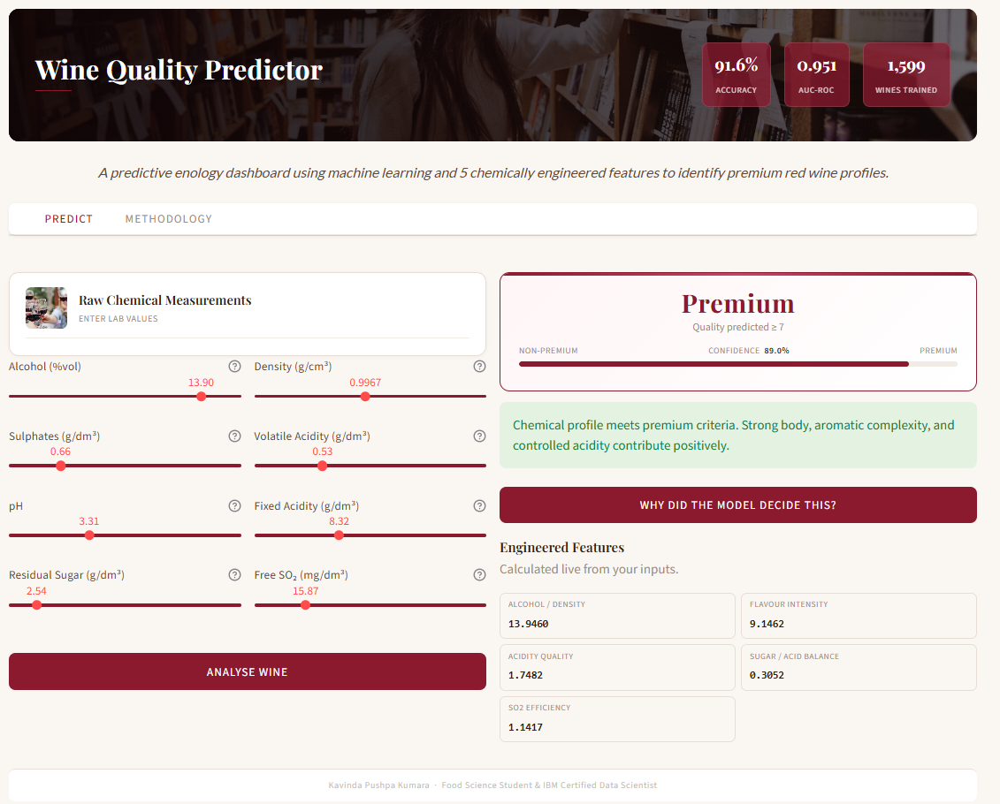

#  Wine Quality Prediction — ML + Streamlit Web App

> Predicting premium red wines using chemically engineered features and a Random Forest classifier

## Overview

This project builds a **binary classifier** that identifies *Premium* red wines (quality score ≥ 7) from the [UCI Wine Quality dataset](https://archive.ics.uci.edu/ml/datasets/wine+quality). 

Instead of feeding all 11 raw lab measurements into the model, **5 chemically meaningful features** are engineered from the raw data. Each encodes a principle that winemakers and oenologists use to assess quality.

The model is deployed as a **Streamlit web app** where users adjust chemical parameters via sliders and receive an instant prediction with feature contribution explanations.

**Author:** Kavinda Pushpa Kumara  
**Background:** Food Science Student · IBM Certified Data Scientist

🔗 **Live Demo:** [wine-quality-predictorapp](https://wine-quality-predictorapp-c7kcqxdnyceobuhepcy3vb.streamlit.app/)

## Table of Contents

- [Project Highlights](#project-highlights)
- [Engineered Features](#engineered-features)
- [Model & Methodology](#model--methodology)
- [App Features](#app-features)
- [App Screenshot](#app-screenshot)
- [Results](#results)
- [References](#references)
- [License](#license)

## Project Highlights

- **Domain-informed feature engineering**: Raw measurements combined into ratios that capture body, aroma, acidity balance and preservation
- **Correct SMOTE implementation**: Applied inside each CV fold using `imblearn.Pipeline`, preventing data leakage that inflates most tutorial models
- **Baseline comparison**: A majority-class `DummyClassifier` is included to give metrics honest context. Raw accuracy is misleading with ~14% premium wines
- **Precision-recall trade-off analysis**: Threshold tuning curve shows how to balance false Premium labels against missed premium wines for different business priorities
- **Transparent deployment**: Streamlit app shows per-prediction feature contributions alongside global model importances, with full methodology explanation

## Engineered Features

| Feature | Formula | Winemaking Principle | Correlation |
| --- | --- | --- | --- |
| `alcohol_density_ratio` | alcohol ÷ density | Body and mouthfeel. Higher ratio = fuller bodied wine | +0.47 |
| `flavor_intensity` | sulphates × alcohol | Aroma complexity. Sulphates protect volatile compounds extracted by alcohol | +0.39 |
| `acidity_quality` | pH × volatile acidity | Fault detection. Penalises high volatile acidity, vinegar off flavours | -0.37 |
| `sugar_acid_balance` | residual sugar ÷ fixed acidity | Sensory sweetness. Sweetness perception relative to acid backbone | -0.01 |
| `so2_efficiency` | free SO₂ ÷ alcohol | Preservation efficiency. Normalised SO₂ avoids oxidation and over sulfiting | -0.13 |

`sugar_acid_balance` has weak marginal correlation with quality, approx -0.03, but is retained for its established role in winemaking sensory science and its potential interaction effects in the tree model.

## Model & Methodology

**Algorithm:** Random Forest Classifier  
**Dataset:** UCI Red Wine Quality, 1,599 Portuguese Vinho Verde wines  
**Class imbalance:** ~14% premium wines, addressed with SMOTE + `class_weight='balanced'`

**Key design decisions:**
- Feature selection correlation and importance analysis run on **training data only**. The test set is never seen until final evaluation
- `imblearn.Pipeline` ensures SMOTE synthetic samples are generated per fold, not across the full training set
- Model is evaluated on **F1 score and AUC-ROC**, not accuracy, due to class imbalance

## App Features

| Feature | Description |
| --- | --- |
| Interactive sliders | 8 raw chemical inputs with dataset mean defaults |
| Instant prediction | Premium / Non-Premium with confidence percentage |
| Decision explanation | Per-prediction feature contribution chart (importance × scaled value) |
| Global importances | RF feature importance bar chart from the trained model |
| Scientific methodology | Full winemaking rationale for each engineered feature |
| Model transparency | Dataset, algorithm, limitations and threshold guidance disclosed |

## Demo

*Interactive sliders with instant prediction and feature contributions*

## Results

| Model | Accuracy | F1 (Premium) | AUC-ROC |
| --- | --- | --- | --- |
| Baseline (majority class) | 86.4% | 0.000 | 0.500 |
| 5 Raw features (top by correlation) | 90.00% | 0.686 | 0.927 |
| **5 Engineered features** | **91.56%** | **0.710** | **0.951** |

The baseline row illustrates why accuracy is not a useful metric here. A classifier that always predicts "Non-Premium" scores 86% by doing nothing. F1 and AUC-ROC are the meaningful measures.

**Key findings:**
- Engineered features outperform both the baseline and a model trained on the 5 most correlated raw features
- The improvement is consistent across all three metrics, validating the domain informed feature engineering approach
- AUC-ROC of 0.951 indicates excellent separability between premium and non-premium classes
##
#
## References

- Cortez, P., Cerdeira, A., Almeida, F., Matos, T., & Reis, J. (2009). *Modeling wine preferences by data mining from physicochemical properties.* Decision Support Systems, 47(4), 547-553.
- Peynaud, E. (1987). *Knowing and Making Wine.* Wiley.
- OIV (2023). *International Code of Oenological Practices.* International Organisation of Vine and Wine.
- UCI Machine Learning Repository: [Wine Quality Data Set](https://archive.ics.uci.edu/ml/datasets/wine+quality)

## License

This project is licensed under the MIT License. See the [LICENSE](LICENSE) file for details.

